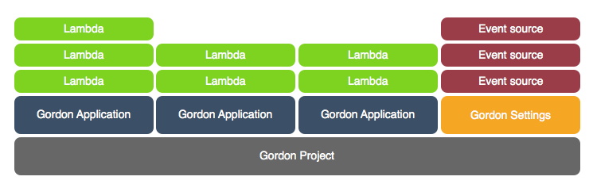

Welcome to Gordon
=================

Welcome to Gordon's documentation. I recommend that you get started with :doc:`installation` and then head over to the :doc:`quickstart`.
Besides the Quickstart, there are also several tutorials for some of the different available event sources.

If you are the kind of person who wants to learn by example, there are lot's in our `Examples <https://github.com/jorgebastida/gordon/tree/master/examples>`_ directory in github.

First Steps
-------------

Your first steps using gordon.

.. toctree::
   :maxdepth: 2

   installation
   quickstart

In detail
----------

In detail explanations of how everything works together.

.. toctree::
   :maxdepth: 2

   project
   apps
   lambdas
   settings
   parameters
   parameters_advanced
   eventsources
   contrib
   faq

Tutorials
-----------

If you like step by step tutorials... this is your place!

.. toctree::
   :maxdepth: 1
   :glob:

   tutorials/*
