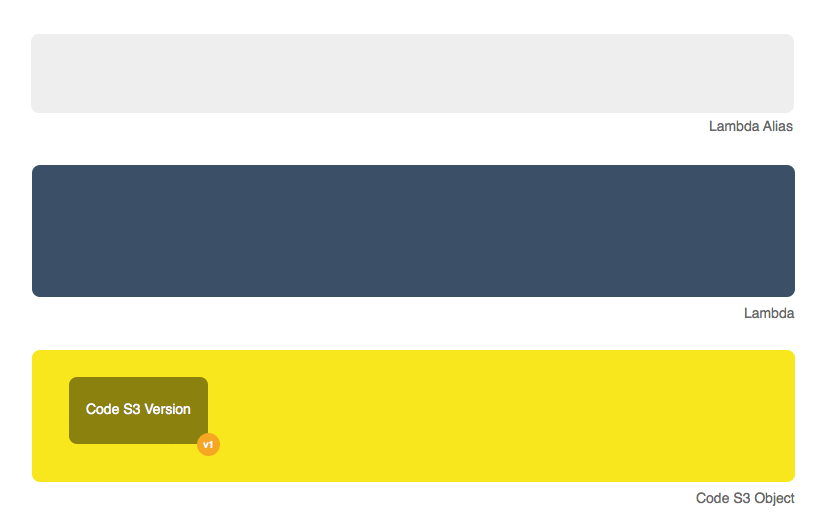

Lambdas
========

Gordon has two aims:
 * Easily deploy and manage lambdas.
 * Easily connect those lambdas to other AWS services (kinesis, dynamo, s3, etc...)

Lambdas are simple functions written in any of the supported AWS languages (python, javascript and java).
If you want to know more, you can read AWS documentation in the topic:

  * `What Is AWS Lambda? <http://docs.aws.amazon.com/lambda/latest/dg/welcome.html>`_
  * `AWS Lambda FAQs <https://aws.amazon.com/lambda/faqs/>`_
  * `AWS Lambda Limits <http://docs.aws.amazon.com/lambda/latest/dg/limits.html>`_

Working with lambdas is quite easy to start with, but once you want to develop
some complex integrations, it becomes a bit of a burden to deal with all the
required steps to put some changes live. Gordon tries to make the entire process
as smooth as possible.

In gordon, Lambdas are resources that you'll group and define within apps. The idea
is to keep Lambdas with the same business domain close to each other in the same app.

.. image:: _static/structure/lambdas.png

Before we continue, there is a bit of terminology we need to make clear:

=====================  ================================================================================================
Term                   Description
=====================  ================================================================================================
``lambda``             Is a static working piece of code ready to be run on AWS.
``lambda version``     Static point-in-time representation of a working lambda.
``lambda alias``       Pointer to a lambda.
``code bucket``        S3 bucket where your lambda code is uploaded.
``code``               S3 Object which contains your lambda code and all required libraries/packages (zip)
``code version``       S3 Object Version of one of your lambda code.
``runtime``            Language in which the lambda code is written (python, javascript or java)
=====================  ================================================================================================

What gordon will do for you?
-----------------------------

* Download any external requirements your lambdas might have.
* Create a zip file with your lambda, packages and libraries.
* Upload this file to S3.
* Create a lambda with your code and settings (memory, timeout...)
* Publish a new version of the lambda.
* Create an alias named ``current`` pointing to this new version.
* Create a new IAM Role for this lambda and attach it.

As result, your lambda will be ready to run on AWS!



As you can imagine, this is quite a lot of things to do every time you want to simply deploy a new change! That's where gordon tries to help.

With simply two commands, ``build`` and ``apply`` you'll be able to deploy your changes again and again with no effort.


Why the current alias is important?
------------------------------------

The ``current`` alias gordon creates pointing to your most recent lambda is really important.
When gordon creates a new event sources (like S3, Dynamo or Kinesis), it'll make those call the lambda aliased as ``current`` instead of the ``$LATEST``.

This is really important to know, because it enables you to (in case of neccesary) change your ``current`` alias to point to any previous version of the same lambda without
needing to re-configure all related event sources.

Any subsequent deploy to the same stage will point the ``current`` alias to your latest function.

For more information you can read `AWS Lambda Function Versioning and Aliases <http://docs.aws.amazon.com/lambda/latest/dg/versioning-aliases.html>`_.

.. _lambdas-anatomy:

Anatomy of a Lambda
--------------------

The following is the anatomy of a lambda in gordon.

.. code-block:: yaml

  lambdas:

    { LAMBDA_NAME }:
      code: { PATH }
      handler: { STRING }
      memory: { NUMBER }
      timeout: { NUMBER }
      runtime: { RUNTIME_NAME }
      description: { STRING }
      build: { STRING }
      role: { MAP }
      vpc: { STRING }
      context: { CONTEXT_NAME }
      context-destination: { PATH }
      auto-vpc-policy: { BOOLEAN }
      auto-run-policy: { BOOLEAN }
      cli-output: { BOOLEAN }
      environment:
         { MAP }
      policies:
        { POLICY_NAME }:
          { MAP }
        ...

The best way to organize your lambdas is to register them inside the ``settings.yml`` file of your apps within your :doc:`project`.


Lambda Properties
-------------------


Lambda Name
^^^^^^^^^^^^^^^^^^^^^^

===========================  ============================================================================================================
Name                         Key of the ``lambdas`` map.
Required                     Yes
Valid types                  ``string``
Max length                   30
Description                  Name for your lambda. Try to keep it as short and descriptive as possible.
===========================  ============================================================================================================


code
^^^^^^^^^^^^^^^^^^^^^^

===========================  ============================================================================================================
Name                         ``code``
Required                     Yes
Valid types                  ``string``
Max length                   30
Description                  Path where the code of your lambda is
===========================  ============================================================================================================

When creating lambdas you can:

* Put all the code of your lambda in the same file and make ``code`` point to it:
    * ``code: code.py``
    * ``code: example.js``
* Put your code in several files within a folder and make ``code`` point to this directory:
    * ``code: myfolder``
    * Remember: When you point ``code`` to a directory you need to remember to specify the ``runtime`` property of your lambda as gordon can't infer it from the filename.

Simple python lambda:

.. code-block:: yaml

    lambdas:
      hello_world:
        code: functions.py


Folder javascript lambda:

.. code-block:: yaml

    lambdas:
      hello_world:
        code: myfolder
        handler: file.handler
        runtime: nodejs6.10


Java lambda:

.. code-block:: yaml

    lambdas:
      hello_world:
        code: myfolder
        handler: example.Hello::handler
        runtime: java8


handler
^^^^^^^^^^^^^^^^^^^^^^

===========================  ============================================================================================================
Name                         ``handler``
Required                     No
Default                      ``handler``
Valid types                  ``string``, ``reference``
Max length                   30
Description                  Name of the function within ``code`` which will be the entry point of you lambda.
===========================  ============================================================================================================

.. code-block:: yaml

  lambdas:
    hello_world:
      code: functions.py
      handler: my_handler

For lambdas using the java runtime, this handler will need to have the following format (``package.class::method``):

.. code-block:: yaml

  lambdas:
    hello_world:
      code: helloworld
      runtime: java8
      handler: helloworld.Hello::handler

.. note::

  For more information about Java handlers `Java Programming Model Handler Types <http://docs.aws.amazon.com/lambda/latest/dg/java-programming-model-handler-types.html>`_


memory
^^^^^^^^^^^^^^^^^^^^^^

===========================  ============================================================================================================
Name                         ``memory``
Required                     No
Default                      ``128``
Valid types                  ``integer``, ``reference``
Max                          ``1536``
Min                          ``128``
Description                  Amount of memory your lambda will get provisioned with
===========================  ============================================================================================================

.. code-block:: yaml

  lambdas:
    hello_world:
      code: functions.py
      memory: 1536

timeout
^^^^^^^^^^^^^^^^^^^^^^

===========================  ============================================================================================================
Name                         ``timeout``
Required                     No
Default                      ``3``
Valid types                  ``integer``, ``reference``
Max                          ``300``
Min                          ``1``
Description                  The function execution time (in seconds) after which Lambda terminates the function
===========================  ============================================================================================================

Because the execution time affects cost, set this value based on the function's expected execution time.

.. code-block:: yaml

  lambdas:
    hello_world:
      code: functions.py
      timeout: 300

runtime
^^^^^^^^^^^^^^^^^^^^^^

===========================  ============================================================================================================
Name                         ``runtime``
Required                     Depends
Valid types                  ``runtime``
Description                  Runtime of your lambda
===========================  ============================================================================================================

Valid runtimes:

=======================================================  ================
Runtime                                                  AWS Runtime
=======================================================  ================
``node``, ``nodejs``, ``node0.10`` and ``nodejs0.10``    ``nodejs``
``node4.3`` and ``nodejs4.3``                            ``nodejs4.3``
``node6.10```                                            ``nodejs6.10``
``python`` and ``python2.7``                             ``python2.7``
``java`` and ``java8``                                   ``java8``
=======================================================  ================

If you don't specify any runtime, Gordon tries to auto detect it based on the extensions of the ``code`` file.

=====================  ===============
Extension              AWS Runtime
=====================  ===============
``.js``                ``nodejs6.10``
``.py``                ``python2.7``
=====================  ===============

For folder based lambdas the ``code`` property is a directory and not a file, so the runtime can't be inferred.

For these situations, you can manually specify the runtime using this setting:

.. code-block:: yaml

    lambdas:
      hello_world:
        code: hellojava
        runtime: java8


description
^^^^^^^^^^^^^^^^^^^^^^

===========================  ============================================================================================================
Name                         ``description``
Required                     No
Default                      *Empty*
Valid types                  ``string``, ``reference``
Description                  Human-readable description for your lambda.
===========================  ============================================================================================================

.. code-block:: yaml

  lambdas:
    hello_world:
      code: functions.py
      description: This is a really simple function which says hello


.. _lambda-build:

build
^^^^^^^^^^^^^^^^^^^^^^

===========================  ============================================================================================================
Name                         ``build``
Required                     No
Valid types                  ``string``, ``list``
Description                  Build process for collecting resources of your lambda
===========================  ============================================================================================================

This property defines which are the commands gordon needs to run in order to collect all the resources from your lambda and
copying them to an empty target directory. Once the collection command finishes, gordon will create a zip file with the content
of that folder.

This property has one default implementation per available runtime (Java, Javascript, Python), which covers most of the simple use cases, but
there are certain use situations where you might need further fine control.

These are the default implementations gordon will use if you leave this property blank:

Python

.. code-block:: yaml

    build:
      - cp -Rf * {target}
      - echo "[install]\nprefix=" > {target}/setup.cfg
      - {pip_path} install -r requirements.txt -q -t {target} {pip_install_extra}
      - cd {target} && find . -name "*.pyc" -delete

Node

.. code-block:: yaml

  build:
    - cp -Rf * {target}
    - cd {target} && {npm_path} install {npm_install_extra}

Java

.. code-block:: yaml

    build: {gradle_path} build -Ptarget={target} {gradle_build_extra}

As you can see, the value of ``build`` can be either a string or a list of strings. Gordon will process them sequentially within your lambda directory.

There are certain variables you can use to customize this ``build`` property.

=======================  ================================================================================================
Variable                 Description
=======================  ================================================================================================
``target``               Destination folder where you need to put the code of your lambda
``pip_path``             ``pip`` path. You can customize this using the ``pip-path`` setting in your settings
``npm_path``             ``npm`` path. You can customize this using the ``npm-path`` setting in your settings
``gradle_path``          ``gradle`` path. You can customize this using the ``gradle-path`` setting in your settings
``pip_install_extra``    Extra arguments you can define using ``pip-install-extra`` in your settings
``npm_install_extra``    Extra arguments you can define using ``npm-install-extra`` in your settings
``gradle_build_extra``   Extra arguments you can define as part of ``gradle-build-extra`` in your settings
``project_path``         Root directory of your project
``project_name``         Name of your project
``lambda_name``          Name of your lambda
=======================  ================================================================================================


This is the minimal version of what a build command that copies your lambda directory would look like:

.. code-block:: yaml

    lambdas:
      hello_world:
        code: mycode
        runtime: python
        handler: code.handler
        build: cp -Rf * {target}


You can use this ``build`` property in conjunction with some more powerful build tools such as ``Makefile``, ``npm``, ``gulp``, ``grunt``
or simple ``bash`` files.

In this example, we make ``babel`` process our javascript files, and leave them in ``TARGET``.

.. code-block:: yaml

    lambdas:
      hello_world:
        code: mycode
        runtime: node
        handler: code.handler
        build: TARGET={target} npm run build

.. code-block:: json

    {
      "babel": {
        "presets": [
          "es2015"
        ]
      },
      "devDependencies": {
        "babel-cli": "^6.8.0",
        "babel-preset-es2015": "^6.6.0"
      },
      "scripts": {
          "build": "babel *.js --out-dir $TARGET"
      }
    }


role
^^^^^^^^^^^^^^^^^^^^^^

===========================  ============================================================================================================
Name                         ``role``
Required                     No
default                      Gordon will create a minimal role for this function
Valid types                  ``arn``, ``reference``
Description                  ARN of the lambda role this function will use.
===========================  ============================================================================================================

If not provided, gordon will create one role for this function and include all necessary ``policies`` *(This is the default and most likely behaviour you want).*

.. code-block:: yaml

  lambdas:
    hello_world:
      code: functions.py
      role: arn:aws:iam::account-id:role/role-name

.. _lambdas-vpc:

vpc
^^^^^^^^^^^^

===========================  ============================================================================================================
Name                         ``vpc``
Required                     No
Valid types                  ``vpc-name``
Description                  Name of the vpc where this lambda should be deployed.
===========================  ============================================================================================================

If the Lambda function requires access to resources in a VPC, specify a VPC configuration that Lambda uses to set up an elastic network interface (ENI).
The ENI enables your function to connect to other resources in your VPC, but it doesn't provide public Internet access.

If your function requires Internet access (for example, to access AWS services that don't have VPC endpoints), configure a Network Address Translation (NAT) instance
inside your VPC or use an Amazon Virtual Private Cloud (Amazon VPC) NAT gateway. For more information, see `NAT Gateways <http://docs.aws.amazon.com/AmazonVPC/latest/UserGuide/vpc-nat-gateway.html>`_ in the Amazon VPC User Guide.

.. code-block:: yaml

  lambdas:
    hello_world:
      code: functions.py
      vpc: my-vpc


You need to define some properties about your vpc (in this example ``my-vpc``) in the project settings.

.. code-block:: yaml

    ---
    project: vpcexample
    ...

    vpcs:
        my-vpc:
            security-groups:
                - sg-00000000
            subnet-ids:
                - subnet-1234567a
                - subnet-1234567b
                - subnet-1234567c


If ``auto-vpc-policy`` is ``True``, gordon will attach to your lambda role the required policy which would allow it to access the vpc. If it is ``False``, you'll need
to do this by yourself.

context
^^^^^^^^^^^^

===========================  ============================================================================================================
Name                         ``context``
Required                     No
default                      ``default``
Valid types                  ``context-name``
Description                  Name of the context you want to inject into this lambda.
===========================  ============================================================================================================

For more information about contexts you can read about them in :doc:`contexts`.

.. code-block:: yaml

  lambdas:
    hello_world:
      code: functions.py
      context: context_name


context-destination
^^^^^^^^^^^^^^^^^^^^^

===========================  ============================================================================================================
Name                         ``context-destination``
Required                     No
default                      ``.context``
Valid types                  ``string``
Description                  Path where gordon should put the context json file.
===========================  ============================================================================================================

For more information about contexts you can read about them in :doc:`contexts`.

.. code-block:: yaml

  lambdas:
    hello_world:
      code: functions.py
      context-destination: my-customize-context-file.json


cli-output
^^^^^^^^^^^^^^^^^^^^^^

===========================  ============================================================================================================
Name                         ``cli-output``
Required                     No
Default                      True
Valid types                  ``boolean``
Description                  Output the lambda ARN as part of the ``apply`` output
===========================  ============================================================================================================

environment
^^^^^^^^^^^^^^^^^^^^^^

===========================  ============================================================================================================
Name                         ``environment``
Required                     No
Valid types                  ``map``
Description                  Map of environment variables to attach to this lambda.
===========================  ============================================================================================================

policies
^^^^^^^^^^^^^^^^^^^^^^

===========================  ============================================================================================================
Name                         ``policies``
Required                     No
Valid types                  ``map``
Description                  Map of AWS policies to attach to the role of this lambda.
===========================  ============================================================================================================

This is the way you'll give permissions to you lambda to connect to other AWS services such as dynamodb, kinesis, s3, etc...
For more inforamtion `AWS IAM Policy Reference <http://docs.aws.amazon.com/IAM/latest/UserGuide/reference_policies.html>`_

In the following example we attach one policy called ``example_bucket_policy`` to our lambda ``hello_world`` in order to make it possible to read and write a
S3 bucket called ``EXAMPLE-BUCKET-NAME``.

.. code-block:: yaml

  lambdas:
    hello_world:
      code: functions.py
      policies:
        example_bucket_policy:
          Version: "2012-10-17"
          Statement:
            -
              Action:
                - "s3:ListBucket"
                - "s3:GetBucketLocation"
              Resource: "arn:aws:s3:::EXAMPLE-BUCKET-NAME"
              Effect: "Allow"
            -
              Action:
                - "s3:PutObject"
                - "s3:GetObject"
                - "s3:DeleteObject"
                - "dynamodb:GetRecords"
              Resource: "arn:aws:s3:::EXAMPLE-BUCKET-NAME/*"
              Effect: "Allow"


auto-vpc-policy
^^^^^^^^^^^^^^^^^^^

===========================  ============================================================================================================
Name                         ``auto-vpc-policy``
Required                     No
Default                      True
Valid types                  ``boolean``
Description                  Automatically attach to your lambda enough permissions to get a vpc configured.
===========================  ============================================================================================================

If ``auto-vpc-policy`` is ``True``, and you lambda has one ``vpc`` configured, gordon will attach to your lambda role the required policy which would allow it to
access the vpc. If it is ``False``, you'll need to do this by yourself.

.. code-block:: json

    {
        "Version": "2012-10-17",
        "Statement": [
            {
                "Effect": "Allow",
                "Action": [
                    "ec2:CreateNetworkInterface"
                ],
                "Resource": [
                    "*"
                ]
            }
        ]
    }


auto-run-policy
^^^^^^^^^^^^^^^^^^^

===========================  ============================================================================================================
Name                         ``auto-run-policy``
Required                     No
Default                      True
Valid types                  ``boolean``
Description                  Automatically attach to your lambda enough permissions to let it run and push logs to CloudWatch Logs.
===========================  ============================================================================================================

If ``auto-run-policy`` is ``True``, gordon will attach to your lambda role the required policy which would allow it to run and push logs.

.. code-block:: json

    {
        "Version": "2012-10-17",
        "Statement": [
            {
                "Effect": "Allow",
                "Action": [
                    "lambda:InvokeFunction"
                ],
                "Resource": [
                    "*"
                ]
            },
            {
                "Effect": "Allow",
                "Action": [
                    "logs:CreateLogGroup",
                    "logs:CreateLogStream",
                    "logs:PutLogEvents"
                ],
                "Resource": "arn:aws:logs:*:*:*",
            }
        ]
    }
